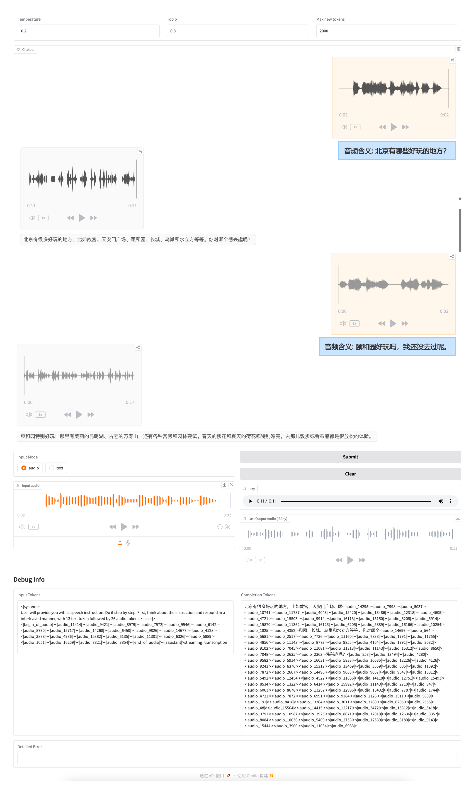
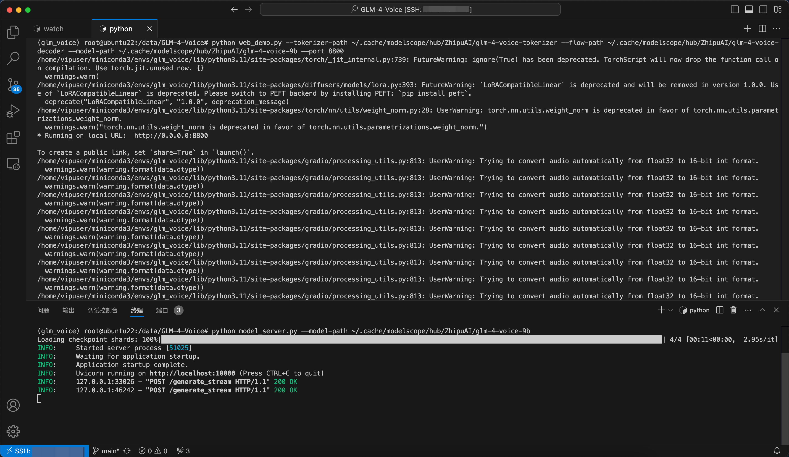

# My-GLM-4-Voice

ubuntu 系统下 [GLM-4-Voice](https://github.com/THUDM/GLM-4-Voice) 部署经验分享。

- [My-GLM-4-Voice](#my-glm-4-voice)
  - [笔者配置:](#笔者配置)
  - [程序运行:](#程序运行)
    - [代码拉取:](#代码拉取)
    - [创建/激活虚拟环境:](#创建激活虚拟环境)
    - [安装依赖项(很耗时):](#安装依赖项很耗时)
      - [修改torch版本:](#修改torch版本)
      - [常规依赖项安装:](#常规依赖项安装)
      - [安装音频处理辅助库](#安装音频处理辅助库)
  - [模型下载:](#模型下载)
  - [主程序运行:](#主程序运行)
    - [启动模型服务:](#启动模型服务)
    - [启动 web 服务:](#启动-web-服务)
    - [测试效果:](#测试效果)


## 笔者配置:

| 系统          | 显卡              | CUDA Version | 模型初始化显存占用 |
|---------------|-------------------|--------------|--------------|
| Ubuntu 22.04  | A100-PCIE-40GB * 1 | 12.2         | 18745MiB    |


## 程序运行:

### 代码拉取:

```bash
git clone --recurse-submodules https://github.com/THUDM/GLM-4-Voice
cd GLM-4-Voice
```

🚨笔者于2024-10-31拉取的GLM-4-Voice代码。

### 创建/激活虚拟环境:

```bash
conda create -n glm_voice python==3.11
conda activate glm_voice
```

### 安装依赖项(很耗时):

#### 修改torch版本:

GLM-4-Voice中`requirements.txt`指定的torch版本为 `torch 2.3.0`，已知 `torch 2.3.0` 在卷积操作时无法正确使用cuDNN，报错信息如下:

```log
/home/vipuser/miniconda3/envs/glm_voice/lib/python3.10/site-packages/torch/nn/modules/conv.py:306: UserWarning: Plan failed with a cudnnException: CUDNN_BACKEND_EXECUTION_PLAN_DESCRIPTOR: cudnnFinalize Descriptor Failed cudnn_status: CUDNN_STATUS_NOT_SUPPORTED (Triggered internally at ../aten/src/ATen/native/cudnn/Conv_v8.cpp:919.)
  return F.conv1d(input, weight, bias, self.stride,
```

pytorch官方github相关issue可查看[这里](https://github.com/pytorch/pytorch/issues/121834)。

解决方案为去除版本号，让pip自动查找符合依赖的版本:

```txt
torch
torchaudio
```

#### 常规依赖项安装:

```bash
pip install -r requirements.txt
pip install accelerate
# 以不安装依赖的方式安装matcha-tts(作者少写了这个库)
pip install --no-deps matcha-tts
```

如果你使用的是Linux系统(例如ubuntu 22.04)，运行`pip install -r requirements.txt`后终端提示:

```log
Looking in indexes: https://pypi.tuna.tsinghua.edu.cn/simple/
Ignoring onnxruntime: markers 'sys_platform == "darwin" or sys_platform == "windows"' don't match your environment
```

不必惊慌，这表示这个依赖项只在 sys_platform 为 darwin（macOS）或 windows 时安装。`onnxruntime-gpu==1.16.0; sys_platform == 'linux'`会自动帮你安装Linux所需的onnx配置。

#### 安装音频处理辅助库

```bash
sudo apt update
apt install ffmpeg
# 查看安装的 ffmpeg 版本
ffmpeg -version
```

如果不安装`ffmpeg`，运行`web_demo.py`会提示缺少`ffprobe`而引发报错。

> ffprobe 是 FFmpeg 工具包的一部分，专门用于分析媒体文件的元数据，而 ffmpeg 是用于实际转换或处理音视频文件的工具。


## 模型下载:

由于笔者使用Git LFS从HF和MS均拉取不到模型，故采用利用代码从MS拉取模型。方式如下:

```bash
cd model_dl
# 下载GLM-4-Voice-Tokenizer
python dl_glm_voice_tokenizer.py
# 下载GLM-4-Voice-Decoder
python dl_glm_voice_decoder.py
# 下载GLM-4-Voice-9B
python dl_glm_voice.py
```

模型均保存在 `~/.cache/modelscope/hub/ZhipuAI/` 目录下。


## 主程序运行:

### 启动模型服务:

```bash
python model_server.py --model-path ~/.cache/modelscope/hub/ZhipuAI/glm-4-voice-9b
```

### 启动 web 服务:

```bash
python web_demo.py --tokenizer-path ~/.cache/modelscope/hub/ZhipuAI/glm-4-voice-tokenizer --flow-path ~/.cache/modelscope/hub/ZhipuAI/glm-4-voice-decoder --model-path ~/.cache/modelscope/hub/ZhipuAI/glm-4-voice-9b
```

### 测试效果:

- 上传`example_wav`文件夹下文件，点击Submit。
- 点击🎙️录制音频，点击Submit。(生成录制文件需要一定的时间)

web效果图如下:

> 音频含义是笔者自己标注的。



终端效果图如下:

